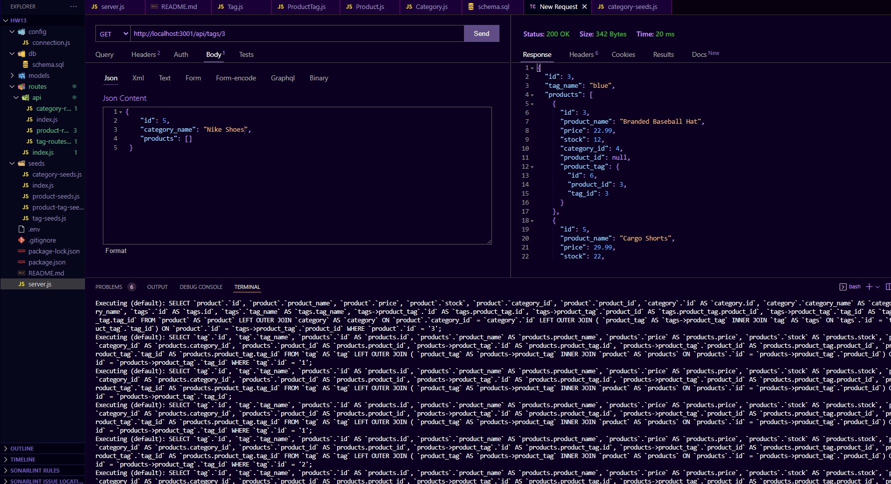

# Object-Relational Mapping (ORM): E-Commerce Back End 📝

```md
AS A manager at an internet retail company
YOU WANT a back end for my e-commerce website that uses the latest technologies
SO THAT your company can compete with other e-commerce companies
```

## Description 📃

This repo/code gives a user the ability to add their database name, and MySQL password to an environment variable file. The user will be able to connnect to the database using Sequelize. Data is seeding to be able to work with. `npm run seed` will be needed to run in the 'integrated terminal.' User can utilize the CRUD ( Create, Update, and Delete ), Method to be able to manage seeded data. Products can be found using the `ID` number. They can then be CRUD.

## Preview 📺

* To view how to run the code below is a YouTube Video walktrough.
[ORM](https://youtu.be/bvUlGN7yujc)

* To view how to run the code below is a YouTube Video walktrough.
[ORMpt2](https://youtu.be/3YyxBcDfCvE)

* Below is an image preview 




## Links 🖊️

* Here is the link to my github 🐈‍⬛: [Github/JMGuzman-784](https://github.com/JMGuzman-784/employee-tracker)

* Here is the code 📜: [JMGuzman-784/Employee-Tracker](https://github.com/JMGuzman-784/employee-tracker/blob/main/index.js)